# TensorFlow打造人脸识别智能小程序

* 技术博客
  * 看了很多算法技术博客，但感觉提升不够

* 业务不熟
  * 遇到复杂的业务场景，依然觉得技术储备不够

* 面试烦恼
  * 读了很多paper，但是面试的时候几句话就讲完了

* 思路维度
  * 跑了很多demo，在面临新的问题的时候没头绪

 

 

* 人脸识别
  * 智能化水平最高
  * 相关业务落地更深入的场景
  * 与其他场景联系紧密
  * 相关场景

 

* ​	人脸智能：
  * 目标检测
  * 关键点定位
  * 活体检测
  * 相似性度量-排序问题
  * 人脸属性回归

## 深度学习基础

### 卷积神经网基本概念

神经网络：多层感知器

深度学习：多隐层的多层感知器

### 前向运算

* 计算输出值的过程称为前向传播

### 反向传播基本概念

* 神经网络(参数模型)训练方法
  * 解决神经网络优化的问题
  * 计算输出层结果与真实值之间的偏差来进行逐层调节参数

### 反向传播迭代过程及参数优化概念

* 神经网络参数训练是一个不断迭代的过程

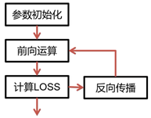

* 参数更新多少
  * 参数优化的问题
  * 导数和学习率

## 反向传播之导数、方向导数、偏导数、梯度

**导数**

* 导数(一元函数)是变化率，是切线的斜率，是瞬时速度、是加速度

 

**方向导数**

l 多元函数在A点无数个切线的斜率的定义。每一个切线都代表一个变化的方向，称之为方向导数

 

**偏导数**

* **多元函数降维时候的变化，**比如二元函数固定y，只让x单独变化，从而看成是关于x的一元函数的变化来研究

 

**梯度**

* 函数在A点无数个变化方向中变化最快的那个方向

 

### 反向传播之梯度下降算法

* 沿着导数下降的方法，进行参数更新
* 选择合适的步长/学习率

* 局部最优解

深度学习发展迅猛的原因
* 数据规模的加大：ImageNet
* 算力：GPU+深度学习芯片
* 算法：分类、检测、分割等


## 卷积神经网络

## 卷积神经网内容概括

* 以卷积结构为主，搭建起来的深度网络
  * 将图片作为网络的输入(w\*h\*c)，自动提取特征(参数优化)，并且对图片的变形(如平移、比例缩放、切斜)等具有高度不变性。

###  基本组成单元

* 卷积
* 池化
* 激活
* BN
* Loss，定义了优化
* 其他

## 卷积运算的定义

* 对图像和滤波矩阵做内积(逐个元素相乘再求和)的操作
* 滤波器
* 每一种卷积对应一种卷积
* lm2col实现卷积运算

### 卷积的重要参数以及卷积核

* 卷积核
  * 最常用为2D卷积核
  * 权重和偏置项
  * 常用卷积核：1x1, 3x3, 5x5
    * 保护位置信息
    * padding时 对称
* 步长
* pad
* num output
* 其他

### 卷积——权值共享与局部连接(局部感受野/局部感知)

* 卷积运算作用在局部
* Feature map使用同一个卷积核运算后得到一种特征
* 多种特征采用多个卷积核(channel)

### 卷积核与感受野

* 2个3x3 = 1个5x5
* 3个3x3 = 1个7x7
* 第一层channel只有3，即使使用7x7的卷积核，计算量也不大
* 如何计算卷积`参数量`?(parameters)
  * (k_w x k_h x In_channel+1) x Out_channel
* 如何计算卷积的`计算量`? (FLOPs)
  * In_w x In_h x (k_w x k_h x In_channel+1) x Out_channel

### 步长

* 下采样的过程
* 输出Feature Map的大小如何变化？
* 参数量和计算量？

### Pad

* 确保Feature Map整数倍变化，对尺度相关的任务尤为重要
  * kernel_size=3, pad =1
  * kernel_size=5, pad=2
  * kernel_size=7, pad=3
* 参数量和计算量？
  * 参数量无变化
  * 输出尺寸发生变化，计算量发生改变

### 池化层

* 池化：对输入的特征图进行压缩
  * 使特征图变小，简化网络计算复杂度
  * 进行特征压缩，提取主要特征
  * 增大感受野
* 常见的池化策略
  * 最大池化(Max Pooling)
  * 平均池化(Average Pooling)
  * 随机池化(Stochastic Pooling)
* 无参

### 激活层

* 增加网络的非线性，进而提升网络的表达能力
  * 非线性
  * 单调性
  * 可微性
  * 取值范围
  * Sigmoid, Tanh, ReLU, ELU, Maxout, Softplux, Softsign
* Sigmoid
  * 范围: 0~1
  * 梯度弥散/梯度饱和
  * 指数运算 -> 耗时
  * 输出不是以零为中心， 0.5，影响寻优，收敛慢
  * 一般使用在最后的输出层
* Tanh
  * 双曲正切函数(Tanh)
  * 完全可微分的，反对称，对称中心在原点
  * 指数运算
  * 卷积神经网基本不用
* ReLU
  * 修正线性单元(Rectified Linear Unit, ReLU)
  * 保留了step函数的生物学启发(只有输入超出阈值时神经元才激活)
  * 函数形式简单，整数时不存在梯度饱和
  * 一旦输入为负数，ReLU就会死掉；通过设置learning_rate使得ReLU处于激活 状态

### BN

* 通过一定的规范化手段，把每层神经网络任意神经元这个输入值的分布强行拉回到均值为0方差为1的标准正态分布
* 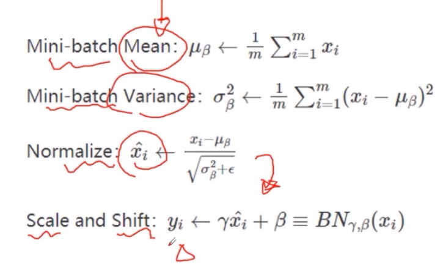
* 优点
  * 减少了参数的人为选择，可以取消Dropout和L2正则项参数，或者采取更小的L2正则项约束参数
  * 减少了对学习率的要求，收敛速度变快，解空间变小
  * 可以不再使用局部响应归一化，BN本身就是归一化网络(局部响应归一化——AlexNet)
  * 破坏原来的数据分布，一定程度上缓解过拟合；相当于 数据中加入noise
* 使用
  * `tf.nn.batch_normalization`
  * `tf.layers.batch_normalization`
  * `tf.contrib.layers.batch_norm`

### 全连接层

* 连接所有的特征，将输出值送给分类器(如softmax分类器)
  * 将网络的输出变为一个向量
  * 可以采用卷积代替全连接层，H x W的卷积核
  * 全连接层是尺度敏感的，如果存在FC层，不能改变输入的大小
  * 配合使用dropout层，防止因为参数量过大而产生过拟合
  * 参数量非常大

### dropout

* 在训练过程中，随机的丢弃一部分输入，此时丢弃部分对应的参数不会更新
* 解决过拟合问题
  * 取平均的作用
  * 减少神经元之间复杂的共适应关系(依赖)

### 损失层

* 损失函数：用来评估模型的预测值和真实值的不一致程度
  * 经验风险最小
  * 结构风险最小 --> 惩罚项，正则项
  * 交叉熵损失、softmax loss等
  
* 损失层定义了使用的损失函数，通过最小化损失来驱动网络的训练

  * 网络的损失通过前向操作计算
  * 网络参数相对于损失函数的梯度则通过反向操作计算
    * 分类任务损失：交叉熵损失
    * 回归任务损失：L1损失， L2损失

* 交叉熵损失

  * log-likelihood cost 逻辑回归似然损失 

    * ==似然：在已知结果的情况下去反推产生结果原因，在建模的时候这组原因就是学习参数，去找到一组参数，通过这组参数能够得到当前已知的结果==

  * 非负性

  * 当真实输出a与期望输出y接近的时候，代价函数接近于0

  * 实现

  * ```python
    tf.nn.softmax_cross_entropy_with_logits(_sentinel=None,labels=None,logits=None,dim=-1,name=None)#label:one hot编码
    tf.nn.sparse_softmax_cross_entropy_with_logits(_sentinel=None,labels=None,logits=None,name=None)
    ```

  * L1, L2, Smooth L1损失

    * Smooth L1是L1，L2的变形，用于Faster RCNN, SSD等网络计算损失
    * 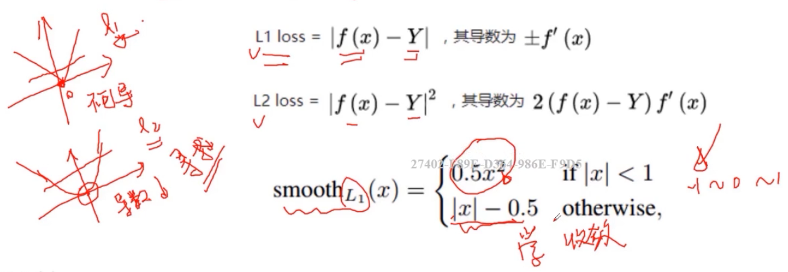

### 卷积神经网发展历史

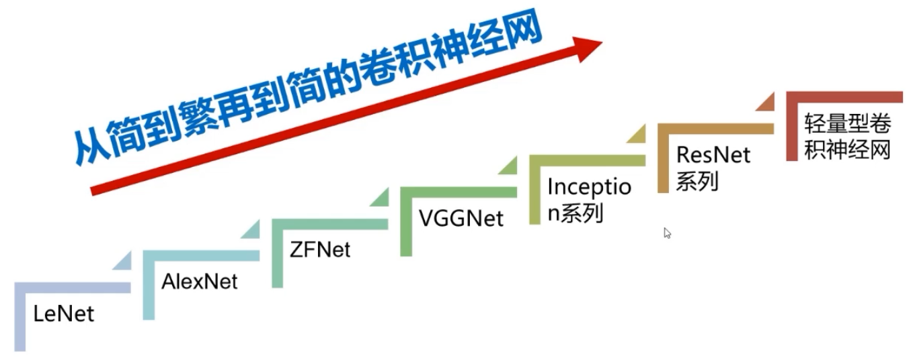


### LeNet与AlexNet-卷积神经网如何减少参数量和计算量

#### AlexNet

* AlexNet特点
  * ReLU非线性激活函数
  * Dropout层防止过拟合--> FC层的标配
  * 数据增强，减少过拟合
  * 标准化层LRN (Local Response Normalization) --> 在后来被弃用 --> BN层替代
* AlexNet 的意义：
  * 证明了CNN在复杂模型下的有效性
  * GPU实现使得训练在可接受的时间范围内得到结果

### ZFNet与VggNet-卷积神经网如何减少参数量和计算量

#### ZFNet

* 在AlexNet基础上进行了细节调整
* 从`可视化的角度`出发，解释CNN有非常好的性能的原因
* 调整第一层卷积核大小为7x7
* 设置卷积参数stride=2

* ZFNet与特征可视化
  * 特征分层次体系结构
  * 深层特征更鲁棒, 对于输入的扰动不敏感
  * 深层特征更有区分度
  * 深层特征收敛更慢

#### VGGNet

* 为了研究`网络深度`对模型准确度的影响，并采用小卷积堆叠的方式，来搭建整个网络结构
* 参数量：138M
* 模型大小>500M
* 特点：
  * 更深的网络结构，结构更加规整、简单
  * 全部使用3x3的小型卷积核和2x2的最大池化层
  * 每次池化后Feature Map宽高降低一半，通道数量增加一倍
  * 网络层数更多、结构更深，模型参数量更大
* 意义 ：
  * 证明了更深的网络，能够提取更好的特征
  * 成为后续很多网络的backbone
  * 规范化了后续网络设计的思路

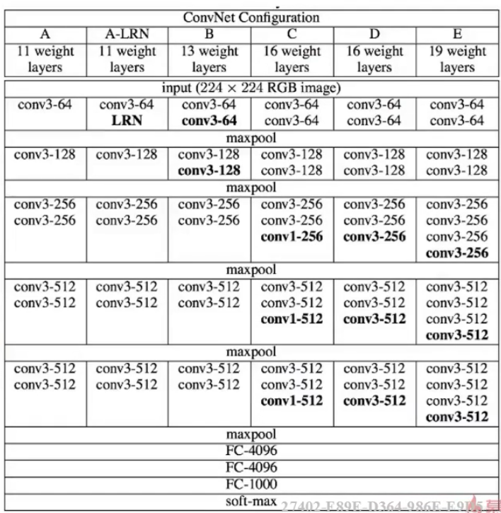

### Inception系列-卷积神经网如何减少参数量和计算量

#### GoogLeNet/Inception v1

在设计网络结构时，不仅强调网络的深度，也会考虑==网络的宽度==，并将这种结构定义为Inception结构(一种网中网(Network In Network)的结构，即原来的节点也是一个网络)

* 14年比赛冠军的model，这个model证明了一件事：用更多的卷积(==宽==)，更深的层次可以得到更好的结构。
* 参数量6.8M
* 模型大小50M

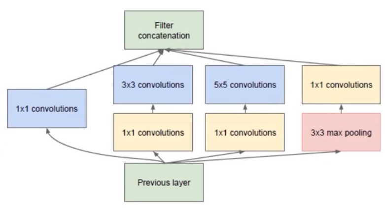

**特点**：

* 更深的网络 结构
* 两个Loss层，降低过拟合风险
* 考虑网络宽度
* ==巧妙地利用1x1的卷积核来进行通道降维，减小计算量==


#### Inception v2/v3

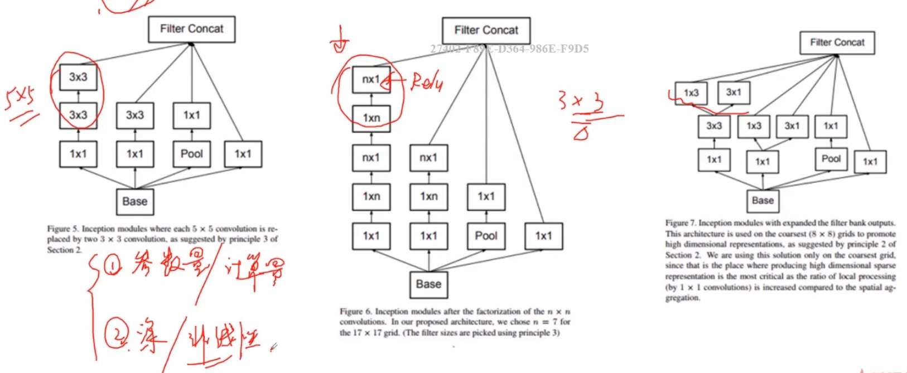


### 从卷积的角度思考，如何减小网络中的计算量？

* 小卷积核来对大卷积核进行拆分，大卷积核只适用于first层
* stride=2代替pooling层，可以降低参数量
* 巧妙地利用1x1的卷积核来进行特征降维，减少channel

### resnet系列网络

#### ResNet

在2015年，由何凯明团队提出，引入跳连的结构来防止梯度消失的问题，进而可以进一步加大网络深度。

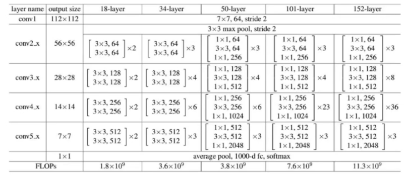


Bootleneck

* Bootneck: 跳连结构(Short-Cut)恒等映射$H(x)=x$解决梯度消失问题，$H(x)=F(x)+x$


BatchNorm

* 每个卷积之后都会配合一个BatchNorm层
* 对数据scale和分布来进行约束
* 简单的正则化，提高网络抗过拟合能力


ResNet的设计特点：

* 核心单元简单堆叠
* `跳连结构`解决网络梯度消失问题
* ==Average Pooling层代替FC层==
* `BN层`加快网络训练速度和收敛时的稳定性
* 加大网络深度(目前已有1000+)，提高模型特征抽取能力


ResNet的变种网络

* ResNeXt: 分组卷积
  * 将channel进行划分，对每一组进行卷积核的学习，减少计算量
* DenseNet：更多的跳连
  * 所有层都有跳连，计算量变大，参数量没有改变
* Wide-ResNet：加大网络宽度
  * 综合考虑网络的深度和宽度
* ResNet In ResNet：网中网
* Inception-ResNet：Inception结构
  * 将Inception中的卷积层替换为ResNet的结构单元


### 网络性能计算量对比

卷积神经网络结构对比

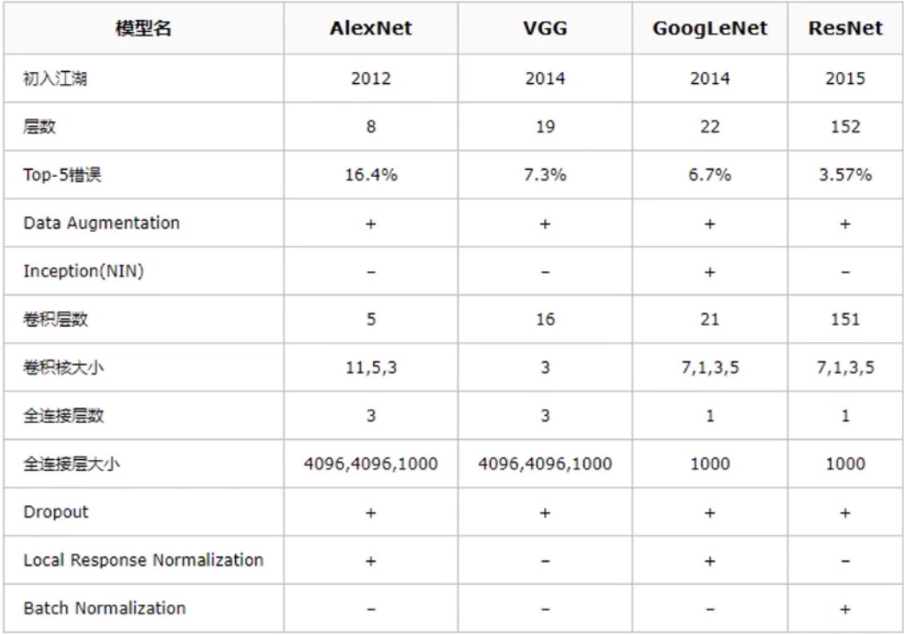

### 轻量型卷积神经网

特点：

* 更好的参数量，减少模型的大小，减少内存占用量，模型更轻
* 更少的计算量，推理速度的变快
* 移动端、嵌入式平台，功耗低

#### SqueezeNet

ICLR-2017

* 提出Fire Module, 由两部分组成：Squeeze层+Expand层
* 特点
  * 1x1卷积核减小计算量
  * 不同size的卷积核，类似Inception

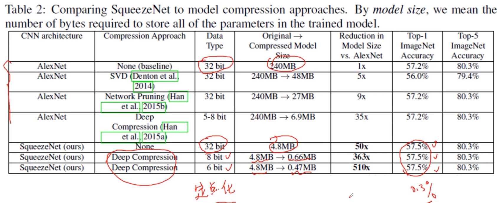


#### MobileNet V1/V2

##### MobileNet V1

由Google团队提出，并发表于CVPR-2017

* Depth-wise Separable Convolution的卷积方式代替传统卷积方式，以达到减少网络权值参数的目的。


1x1 conv减少channle数量256

经过多尺度的卷积核(1x1, 3x3, 5x5, 7x7)

对256个channel进行分组卷积，极端情况下，分为256个组，每组一个卷积核


深度可分离卷积

* Depth-wise Convolution，通道内部的信息
* Point-wise Convolution， 通道之间的信息

* 计算量
* 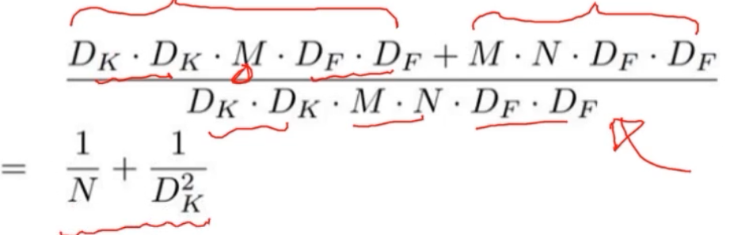


实验比较

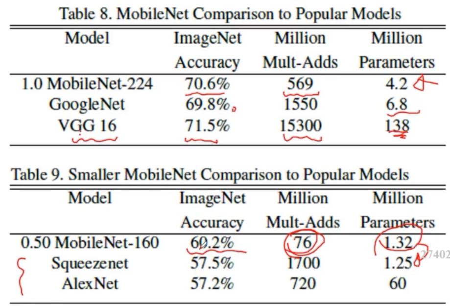


很多芯片对分组卷积支持的不是很好


##### MobileNet V2

* Inverted residuals 倒置卷积
* Linear bottlenecks


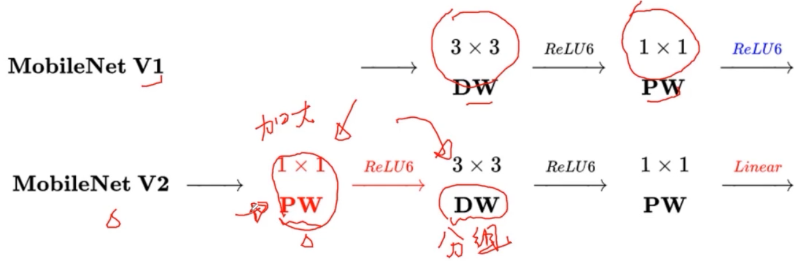

DW中分组卷积的计算量非常小


##### MobileNet V2 Vs MobileNet V1 Vs ResNet

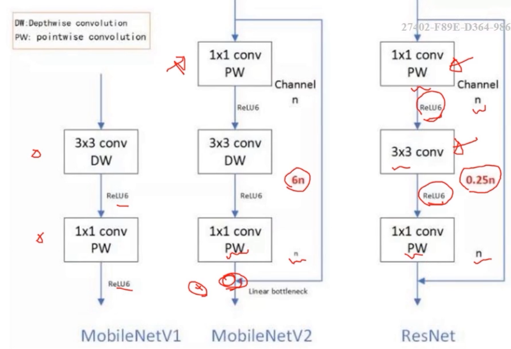

* ==对标准的卷积进行拆分可以压缩计算量，进而减小模型的大小，参数量以及计算量==


#### ShuffleNet V1/V2

##### ShuffleNet V1

由旷世科技提出的一种轻量型卷积网络

* 深度卷积来代替标准卷积
* 分组卷积+通道shuffle


Channel Shuffle

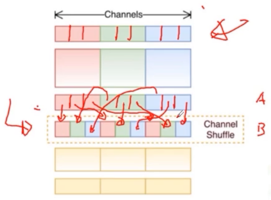


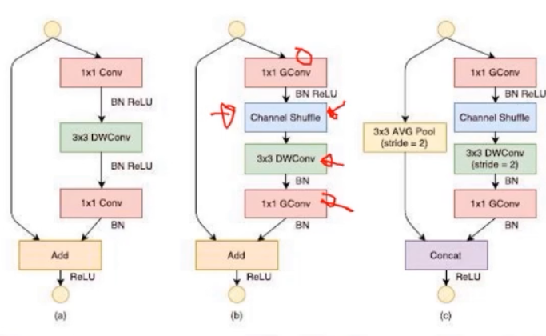


**ShuffleNet VS MobileNet实验效果比较**

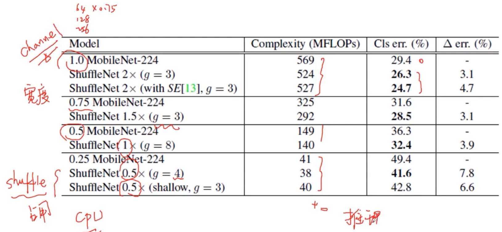

shuffle会占用一定资源和时间

FLOP的时间和推理时间不是完全一致的


##### ShuffleNet V2

* 旷世科技针对ShuffleNet V1改进的轻量型卷积神经网

* ECCV 2018
* 该模型最大的贡献点在于解释了如何去设计轻量型卷积网络的几个标准和规范


轻量型卷积神经网设计标准：

* 相同的通道宽度可最小化`内存访问成本`(MAC)
* 过度的组卷积会增加MAC
* 网络碎片化(例如GooLeNet的多路径结构)会降低并行度
* 元素级运算(Add)不可忽视

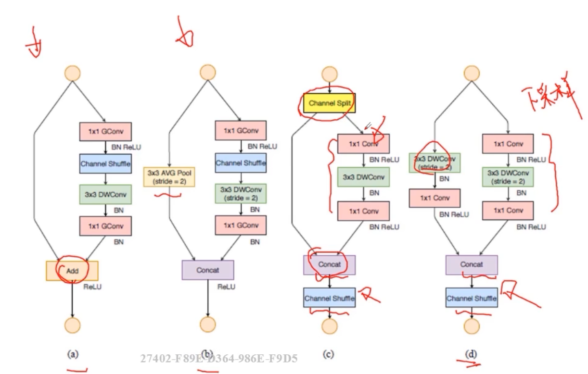

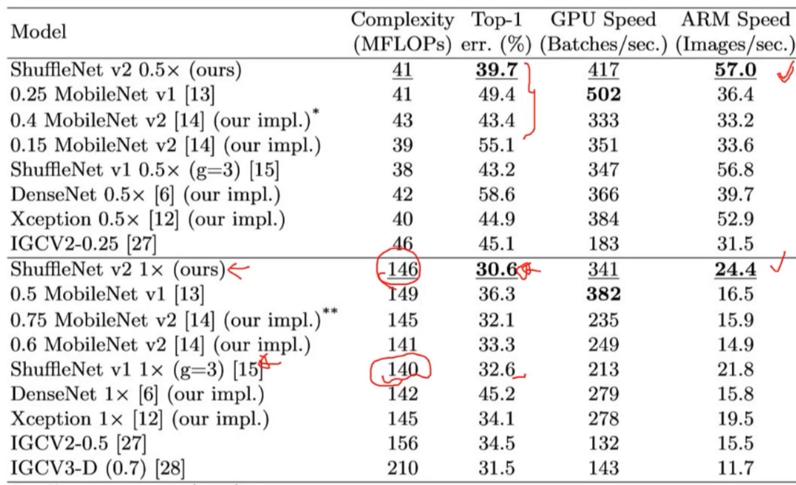

**需要额外实现shuffle层，如果芯片对tensorflow支持很好的话，才不是问题**


#### Xception

由Google提出，arXiv的V1版本于2016年10月公开

同样借鉴了`深度卷积`的思想，但是又存在差异，具体如下：

* Xception先采用1x1卷积，再进行主通道卷积
* Xception在1x1卷积后，加入ReLU

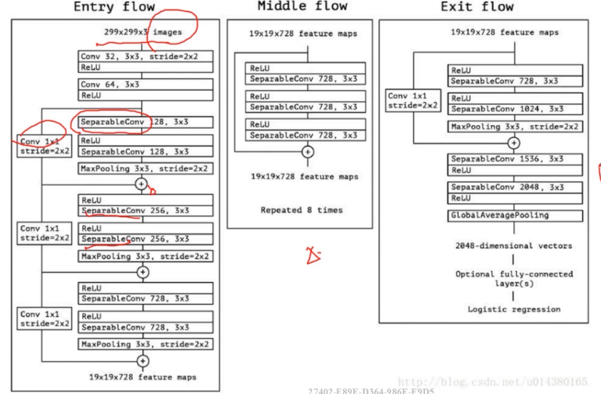

### 多分支的卷积神经网

#### Siamese Net

* 孪生网络
* 余弦距离
  * 余弦距离，也称为余弦相似度，是用向量空间中两个向量夹角的余弦值作为衡量两个个体间差异的大小的度量
  * Center Loss
  * SphereFace
  * CosFace
  * ArcFace
  * CCL
  * AmSoftmax
* 度量问题，相似度
  * 分类问题
  * 回归问题
  * 度量问题
    * 相似度
    * 排序问题

#### Triplet Net

* Anchor + Negative + Positive
* 最小化同类，最大化不同类的距离

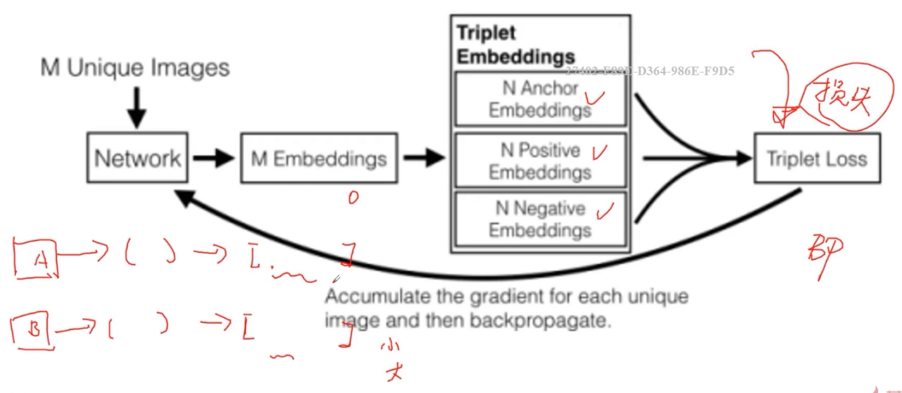

* 提取Embedding Feature
* 细粒度的识别任务
* 正负样本比例失衡——难例挖掘
  * 负样本远远大于正样本


#### Quadruplet Net

* 四分支网络
* 相比Triple Net多加入一张负样本


#### 多任务网络

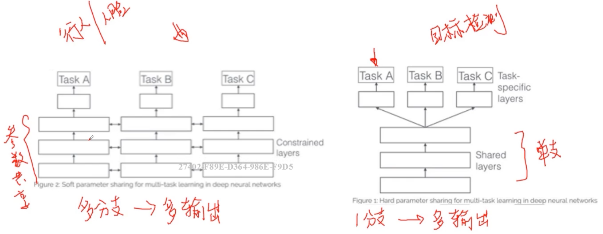

 

### 卷积神经网中的Attention机制

人类大脑在接收和处理外界信号时的一种机制。

* one-host分布或者soft的软分布
* Soft-Attention或者Hard-Attention


Attention实现机制

* 保留所有分量均做加权(即soft attention)
* 在分布中以某种采样策略选取部分分量(即hard attention)
  * 原图，特征图，空间尺度，通道，特征图上的每个元素，不同历史时刻
* ResNet + Attention
* SENet/Channel Attention

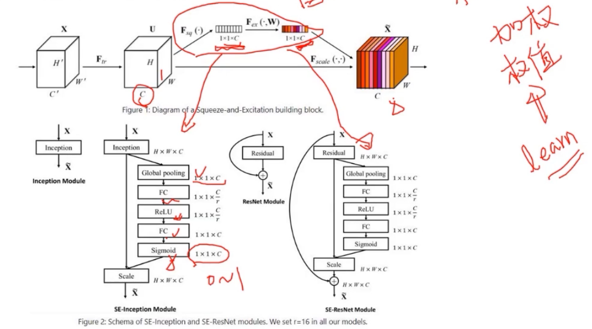


### 卷积神经网的压缩方法

#### 模型剪枝

除去无意义的权重和激活来减少模型的大小

* 贡献度排序
* 去除小贡献度单元
* 重新fine-tuning

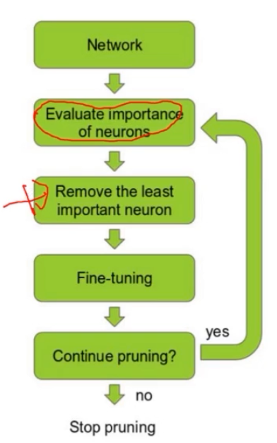


**模型剪枝技巧**

* 全连接部分通常会存在大量的参数冗余
* 对卷积窗口进行剪枝的方式，可以是减少卷积窗口权重，或者直接丢弃掉卷积窗口的某一维度
* 丢弃稀疏的卷积窗口，但这并不会使模型运行速度有数量级的提升
* 首先训练一个较大的神经网络模型，再逐步剪枝得到的小模型


#### 模型量化/定点化

减少数据在内存中的位数操作，可以采用8位类型来表示32位浮点(定点化)或者直接训练低于8位的模型，比如：2bit模型，4bit模型等

* 减少内存开销，节省更多的带宽
* 对于某些定点运算方式，甚至可以消除乘法操作，只剩加法操作，某些二值模型，直接使用位操作
* 代价通常是位数越低，精度下降越明显


在Tensorflow中，通常采用引入量化层的方式来更改计算图，进而达到量化的目的

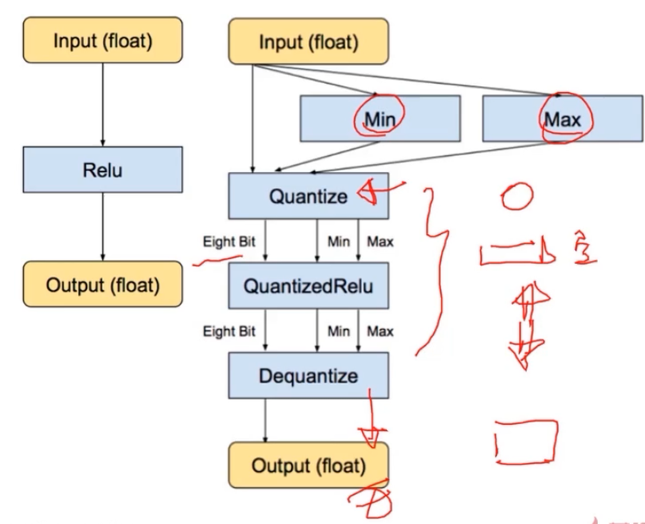

量化过程对于输入的数据找到最大值最小值，通过最大值最小值就可以进行量化，就可以将当前的数据进行任意尺度的归一 ，我们将它归一到8bit的数据上，再进行定点化运算，最后将输出结果转化为原始float型数据


#### 模型蒸馏

教师网络

采用一个大的，复杂的网络来指导一个小的，精简之后的网络模型进行模型训练和学习

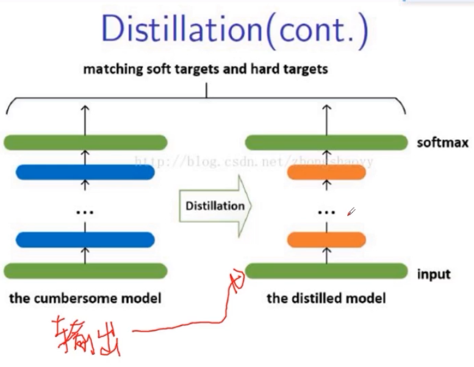


## Tensorflow基础

### 基本概念


### 核心API

### 高层接口(slim)

### Tensorboard调试技巧

### 实现数据增强


## Tensorflow Cifar-10 图像分类


## 人脸检测业务实战


## Flask封装人脸检测模型web服务


## web服务接口调用与人脸检测模块开发


## 人脸匹配业务实战


## 人脸对齐基本概念


## 活体检测业务实战


## 人脸属性业务实战


## 总结

