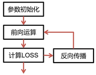

# TensorFlow打造人脸识别智能小程序

* 技术博客
  * 看了很多算法技术博客，但感觉提升不够

* 业务不熟
  * 遇到复杂的业务场景，依然觉得技术储备不够

* 面试烦恼
  * 读了很多paper，但是面试的时候几句话就讲完了

* 思路维度
  * 跑了很多demo，在面临新的问题的时候没头绪

 

 

* 人脸识别
  * 智能化水平最高、
  * 相关业务落地更深入的场景
  * 与其他场景联系紧密
  * 相关场景

 

* ​	人脸智能：
  * 目标检测
  * 关键点定位
  * 活体检测
  * 相似性度量-排序问题
  * 人脸属性回归

## 深度学习基础

### 卷积神经网基本概念

神经网络：多层感知器

深度学习：多隐层的多层感知器

### 前向运算

* 计算输出值的过程称为前向传播

### 反向传播基本概念

* 神经网络(参数模型)训练方法
  * 解决神经网络优化的问题
  * 计算输出层结果与真实值之间的偏差来进行逐层调节参数

### 反向传播迭代过程及参数优化概念

* 神经网络参数训练是一个不断迭代的过程

* 参数更新多少
  * 参数优化的问题
  * 导数和学习率

## 反向传播之导数、方向导数、偏导数、梯度的概念

**导数**

* 导数(一元函数)是变化率，是切线的斜率，是瞬时速度、是加速度

 

**方向导数**

l 多元函数在A点无数个切线的斜率的定义。每一个切线都代表一个变化的方向，称之为方向导数

 

**偏导数**

* **多元函数降维时候的变化，**比如二元函数固定y，只让x单独变化，从而看成是关于x的一元函数的变化来研究

 

**梯度**

* 函数在A点无数个变化方向中变化最快的那个方向

 

### 反向传播之梯度下降算法

* 沿着导数下降的方法，进行参数更新
* 选择合适的步长/学习率

* 局部最优解

深度学习发展迅猛的原因
* 数据规模的加大：ImageNet
* 算力：GPU+深度学习芯片
* 算法：分类、检测、分割等

## 卷积神经网络

## 卷积神经网内容概括

* 以卷积结构为主，搭建起来的深度网络
  * 将图片作为网络的输入(w\*h\*c)，自动提取特征(参数优化)，并且对图片的变形(如平移、比例缩放、切斜)等具有高度不变性。

###  基本组成单元

* 卷积
* 池化
* 激活
* BN
* Loss，定义了优化
* 其他

## 卷积运算的定义

* 对图像和滤波矩阵做内积(逐个元素相乘再求和)的操作
* 滤波器
* 每一种卷积对应一种卷积
* lm2col实现卷积运算

### 卷积的重要参数以及卷积核

* 卷积核
  * 最常用为2D卷积核
  * 权重和偏置项
  * 常用卷积核：1x1, 3x3, 5x5
    * 保护位置信息
    * padding时 对称
* 步长
* pad
* num output
* 其他

### 权值共享与局部连接

### 卷积核与感受野

### 步长与Pad

### 卷积的定义与使用介绍（Tensorflow与Caffe）

### 池化层

### 激活层

### BN

### 全连接层

### dropout

### 损失层

### 卷积神经网发展历史

### LeNet与AlexNet-卷积神经网如何减少参数量和计算量

### ZFNet与VggNet-卷积神经网如何减少参数量和计算量

### Inception系列-卷积神经网如何减少参数量和计算量

### 从卷积的角度思考，如何减小网络中的计算量？

### resnet系列网络

### 网络性能计算量对比

### 轻量型卷积神经网-SqueezeNet

### 轻量型卷积神经网-MobileNet

### 轻量型卷积神经网-ShuffleNet V1

### 轻量型卷积神经网-ShuffleNet V2

### 多分支的卷积神经网

### 卷积神经网中的Attention

### 卷积神经网的压缩方法

## Tensorflow基础

## Tensorflow Cifar-10 图像分类

## 人脸检测业务实战

## Flask封装人脸检测模型web服务

## web服务接口调用与人脸检测模块开发

## 人脸匹配业务实战

## 人脸对齐基本概念

## 活体检测业务实战

## 人脸属性业务实战

## 总结

