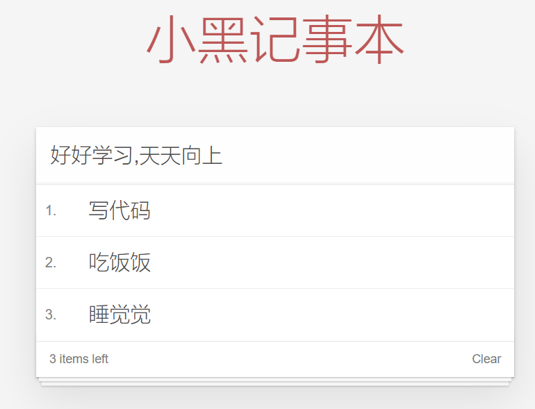
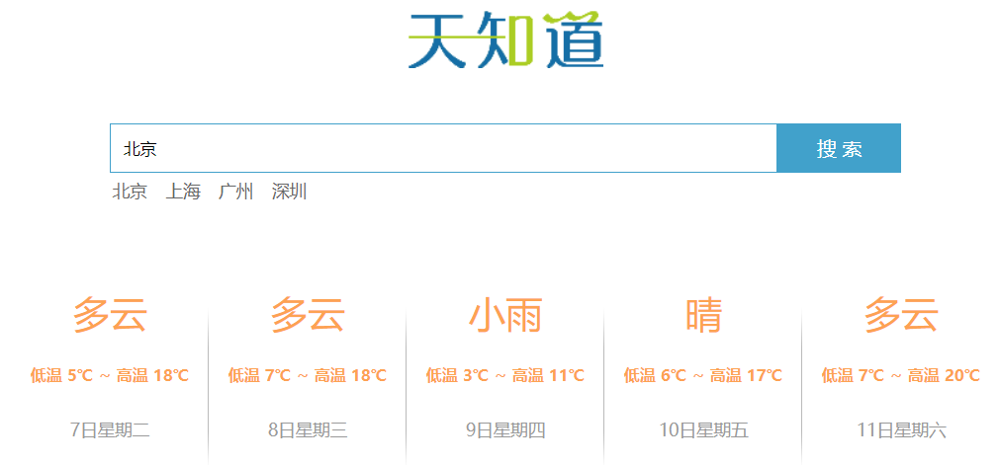
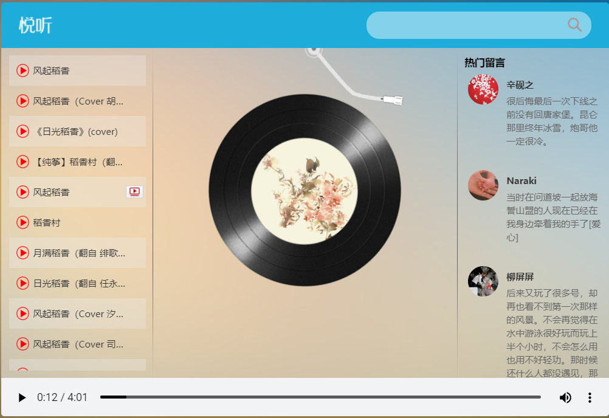

# Vue

[4个小时带你快速入门vue](https://www.bilibili.com/video/av76249419?p=36&t=754)

## Vue基础

### 第一个Vue程序

1. 导入开发版本的Vue.js
2. 创建Vue实例对象，设置el属性和data属性
3. 使用简洁的模板语法把数据渲染到页面上

```html
<script src="https://cdn.jsdelivr.net/npm/vue/dist/vue.js"></script>
<div id="app">
    {{ message }}
</div>
<script>
    var app = new Vue({
        el: '#app',
        data: {
            message: '你好!'
        }
    })
</script>
```

### el：挂载点

1. Vue实例的作用范围

   1. Vue会管理el选项`命中的元素`及其内部的后代元素

2. 是否可以使用其他的选择器？

   1. 可以使用其他的选择器，但是建议使用`ID选择器`

3. 是否可以设置其他的dom元素呢？

   1. 可以使用其他的双标签，不能使用HTML和BODY

   

### data：数据对象

*  vue中用到的数据定义在data中
* data中可以写复杂类型的数据
* 渲染复杂类型数据时，遵守js的语法即可


## 本地应用

### 内容绑定，事件绑定

* v-text: 设置标签的文本值(textContent)
  * 默认写法会替换全部内容，使用差值表达式{{}}可以替换指定内容
  * 内部支持写`表达式`
* **v-html**：设置标签的innerHTML
  * 内容中有`html`结构会被解析为标签
  * `v-text`指令无论内容是什么，只会解析为`文本`
* **v-on**：为元素绑定`事件`
  * 事件名不需要写on
  * 指令可以简写为@
  * 绑定的方法定义在methods属性中
  * 方法内部通过this关键字可以访问定义在data中的数据


#### 计数器

步骤：

1. data中定义数据，比如num
2. methods中添加两个方法，比如add, sub
3. 使用v-text将num设置给span
4. 使用v-on将add, sub分别绑定给+,-按钮
5. 累加的逻辑：小于10累加，否则提示
6. 递减的逻辑：大于0递减，否则提示

```html
<!DOCTYPE html>
<html lang="en">

<head>
    <meta charset="UTF-8">
    <meta name="viewport" content="width=device-width, initial-scale=1.0">
    <title>Vue基础</title>
</head>

<body>
    <script src="https://cdn.jsdelivr.net/npm/vue/dist/vue.js"></script>
    <div id="app">
        <div class="input-num">
            <button @click='sub'>-</button>
            <span>{{ num }}</span>
            <button @click='add'>+</button>
        </div>
    </div>
    <script>
        var app = new Vue({
            el: '#app',
            data: {
                num:1
            },
            methods: {
                add:function(){
                    if(this.num<10){
                        this.num++; 
                    }else{
                        alert("别点了，最大啦")
                    }
                    
                },
                sub:function(){
                    if(this.num>0){
                        this.num--;
                    }else{
                        alert("别点了，最小啦")
                    }
                    
                }
            },
        })
    </script>
</body>

</html>
```

* 创建vue实例时：el(挂载点)， data(数据), methods(方法)
* v-on指令的作用是绑定事件，简写为@
* 方法中通过this，关键字获取data中的数据
* v-text指令的作用是：设置元素的文本值，简写为{{}}
* v-html指令的作用是：设置元素的innerHTML


### 显示切换，属性绑定

* v-show: 根据表达值的真假，切换元素的显示和隐藏(操作**样式**)
  * 原理是修改元素的display，实现显示隐藏
  * 指令后面的内容，最终都会解析为布尔值
  * 值为true元素显示，值为false元素隐藏
  * 数据改变之后，对应元素的显示状态会同步更新
* v-if：根据表达值的真假，切换元素的显示和隐藏(操作**dom**元素)
  * 本质是通过操作dom元素来切换显示状态
  * 表达式的值为true，元素存在于dom树中; 为false，从dom树种移除
* v-bind: 设置元素的属性(比如：src, title, class)
  * 完整的写法是：v-bind:属性名
  * 简写可以直接省略v-bind，只保留`:属性名`
  * 需要动态的增删class建议使用对象的方式

#### 图片切换


```html
<!DOCTYPE html>
<html lang="en">

<head>
  <meta charset="UTF-8" />
  <meta name="viewport" content="width=device-width, initial-scale=1.0" />
  <meta http-equiv="X-UA-Compatible" content="ie=edge" />
  <title>Document</title>
  <link rel="stylesheet" href="./css/index.css" />
</head>

<body>
  <div id="mask">
    <div class="center">
      
      <a href="javascript:void(0)" @click="prev" class="left" v-show="index>0">
        
      </a>
      <a href="javascript:void(0)" @click="next" class="right" v-show="index<imgList.length-1">
        
      </a>
    </div>
  </div>

  <script src="https://cdn.jsdelivr.net/npm/vue/dist/vue.js"></script>

  <script>
    const app = new Vue({
      el: "#mask",
      data: {
        imgList: [
          "./images/00.jpg",
          "./images/01.jpg",
          "./images/02.jpg",
          "./images/03.jpg",
          "./images/04.jpg",
          "./images/05.jpg",
          "./images/06.jpg",
          "./images/07.jpg",
          "./images/08.jpg",
          "./images/09.jpg",
          "./images/10.jpg",
        ],
        index: 0
      },
      methods: {
        // 上一张
        prev() {
          this.index--;
        },
        // 下一张
        next() {
          this.index++;
        }
      }
    });
  </script>
</body>

</html>
```


* 列表数据使用数组保存
* v-bind指令可以设置元素属性，比如src
* v-show和v-if都可以切换元素的显示状态，频繁切换用v-show


### 列表循环，表单元素绑定

* v-for：根据数据生成列表结构

  * 数组经常和v-for结合使用

  * 语法是(`item, index) in 数据`

  * item 和index可以结合其他指令一起使用

  * 数组长度的更新会同步到页面上，是响应式的

  * ```html
    <div id="app">
        <input type="button" value="添加数据" @click="add">
        <input type="button" value="移除数据" @click="remove">
        <ul>
            <li v-for="(it,index) in arr">
                {{ index+1 }}黑马程序员校区:{{ it }}
            </li>
        </ul>
        <h2 v-for="item in vegetables" v-bind:title="item.name">
            {{ item.name }}
        </h2>
    </div>
    <!-- 1.开发环境版本，包含了有帮助的命令行警告 -->
    <script src="https://cdn.jsdelivr.net/npm/vue/dist/vue.js"></script>
    <script>
        var app = new Vue({
            el: "#app",
            data: {
                arr: ["北京", "上海", "广州", "深圳"],
                vegetables: [
                    { name: "西兰花炒蛋" },
                    { name: "蛋炒西蓝花" }
                ]
            },
            methods: {
                add: function () {
                    this.vegetables.push({ name: "花菜炒蛋" });
                },
                remove: function () {
                    this.vegetables.shift();
                }
            },
        })
    </script>
    ```

* v-on补充

  * 事件绑定的方法写成函数调用的形式，可以传入自定义参数

  * 定义方法时需要定义形参来接受传入的实参

  * 事件的后面跟上`.修饰符`可以对事件进行限制

  * `.enter`可以限制触发的按键为回车

  * 事件修饰符有多种

  * ```html
    <div id="app">
        <input type="button" value="点击" @click="doIt(666,'老铁')">
        <input type="text" @keyup.enter="sayHi">
    </div>
    <!-- 1.开发环境版本，包含了有帮助的命令行警告 -->
    <script src="https://cdn.jsdelivr.net/npm/vue/dist/vue.js"></script>
    <script>
        var app = new Vue({
            el:"#app",
            methods: {
                doIt:function(p1,p2){
                    console.log("做it");
                    console.log(p1);
                    console.log(p2);
                },
                sayHi:function(){
                    alert("吃了没");
                }
            },
        })
    </script>
    ```

* v-model：获取和设置==表单==元素的值(**双向数据绑定**)

  * v-model指令的作用是便捷的设置和获取表单元素的值

  * 绑定的数据会和表单元素值相关联

  * 绑定的数据$\leftrightarrow$表单元素的值

  * ```html
    <div id="app">
        <input type="button" value="修改message" @click="setM">
        <input type="text" v-model="message" @keyup.enter="getM">
        <h2>{{ message }}</h2>
    </div>
    <!-- 开发环境版本，包含了有帮助的命令行警告 -->
    <script src="https://cdn.jsdelivr.net/npm/vue/dist/vue.js"></script>
    <script>
        var app = new Vue({
            el:"#app",
            data:{
                message:"黑马程序员"
            },
            methods: {
                getM:function(){
                    alert(this.message);
                },
                setM:function(){
                    this.message ="酷丁鱼";
                }
            },
        })
    </script>
    ```


#### 小黑记事本

功能：新增，删除，统计，清空，隐藏



* 新增
  1. 生成列表结构(v-for 数组)
  2. 获取用户输入(v-model)
  3. 回车，新增数据(v-on .enter 添加数据)
* 删除
  * 点击删除指定内容(v-on splice 索引)
  * 数据改变和数据绑定的元素同步改变
* 统计
  * 统计信息个数(v-text length)
  * 基于数据的开发方式
* 清空
  * 点击清除所有信息(v-on)
* 隐藏
  * 没有数据时，隐藏元素(v-show v-if 数组非空)

```html
<body>
  <!-- 主体区域 -->
  <section id="todoapp">
    <!-- 输入框 -->
    <header class="header">
      <h1>小黑记事本</h1>
      <input v-model="inputValue" @keyup.enter="add" autofocus="autofocus" autocomplete="off" placeholder="请输入任务"
        class="new-todo" />
    </header>
    <!-- 列表区域 -->
    <section class="main">
      <ul class="todo-list">
        <li class="todo" v-for="(item,index) in list">
          <div class="view">
            <span class="index">{{ index+1 }}.</span>
            <label>{{ item }}</label>
            <button class="destroy" @click="remove(index)"></button>
          </div>
        </li>
      </ul>
    </section>
    <!-- 统计和清空 -->
    <footer class="footer" v-show="list.length!=0">
      <span class="todo-count" v-if="list.length!=0">
        <strong>{{ list.length }}</strong> items left
      </span>
      <button v-show="list.length!=0" class="clear-completed" @click="clear">
        Clear
      </button>
    </footer>
  </section>
  <!-- 底部 -->
  <footer class="info">
    <p>
      <a href="http://www.itheima.com/"></a>
    </p>
  </footer>
  <!-- 开发环境版本，包含了有帮助的命令行警告 -->
  <script src="https://cdn.jsdelivr.net/npm/vue/dist/vue.js"></script>
  <script>
    var app = new Vue({
      el: "#todoapp",
      data: {
        list: ["写代码", "吃饭饭", "睡觉觉"],
        inputValue: "好好学习,天天向上"
      },
      methods: {
        add: function () {
          this.list.push(this.inputValue);
        },
        remove: function (index) {
          console.log("删除");
          console.log(index);
          this.list.splice(index, 1);
        },
        clear: function () {
          this.list = [];
        }
      },
    })
  </script>
</body>
```


* 列表结构可以通过v-for指令结合数据生成
* v-on结合事件修饰符可以对事件进行限制，比如.enter
* v-on在绑定事件时可以传递自定义参数
* 通过v-model可以快速的设置和获取表单元素的值
* 基于数据的开发方式


## 网络应用

### axios

* axios必须先导入才可以使用
* 使用get或post方法即可发送对应的请求
* then方法中的回调函数会在请求成功或失败时触发
* 通过回调函数的形参可以获取响应内容，或错误信息

```html
<input type="button" value="get请求" class="get">
<input type="button" value="post请求" class="post">
<!-- 官网提供的 axios 在线地址 -->
<script src="https://unpkg.com/axios/dist/axios.min.js"></script>
<script>
    /*
            接口1:随机笑话
            请求地址:https://autumnfish.cn/api/joke/list
            请求方法:get
            请求参数:num(笑话条数,数字)
            响应内容:随机笑话
        */
    document.querySelector(".get").onclick = function () {
        axios.get("https://autumnfish.cn/api/joke/list?num=6")
        // axios.get("https://autumnfish.cn/api/joke/list1234?num=6")
            .then(function (response) {
            console.log(response);
        },function(err){
            console.log(err);
        })
    }
    /*
             接口2:用户注册
             请求地址:https://autumnfish.cn/api/user/reg
             请求方法:post
             请求参数:username(用户名,字符串)
             响应内容:注册成功或失败
         */
    document.querySelector(".post").onclick = function () {
        axios.post("https://autumnfish.cn/api/user/reg",{username:"盐焗西兰花"})
            .then(function(response){
            console.log(response);
            console.log(this.skill);
        },function (err) {
            console.log(err);
        })
    }

</script>
```


### axios+vue

* axios回调函数中的this已经改变，无法访问到data中数据
* 把this保存起来，回调函数中直接使用保存的this即可

```html
<body>
    <div id="app">
        <input type="button" value="获取笑话" @click="getJoke">
        <p> {{ joke }}</p>
    </div>
    <!-- 官网提供的 axios 在线地址 -->
    <script src="https://unpkg.com/axios/dist/axios.min.js"></script>
    <!-- 开发环境版本，包含了有帮助的命令行警告 -->
    <script src="https://cdn.jsdelivr.net/npm/vue/dist/vue.js"></script>
    <script>
        /*
            接口:随机获取一条笑话
            请求地址:https://autumnfish.cn/api/joke
            请求方法:get
            请求参数:无
            响应内容:随机笑话
        */
        var app = new Vue({
            el:"#app",
            data:{
                joke:"很好笑的笑话"
            },
            methods: {
                getJoke:function(){
                    // console.log(this.joke);
                    var that = this;
                    axios.get("https://autumnfish.cn/api/joke").then(function(response){
                        // console.log(response)
                        console.log(response.data);
                        // console.log(this.joke);
                        that.joke = response.data;
                    },function (err) {  })
                }
            },
        })

    </script>
</body>
```


### 天气预报



* 回车查询
  * 按下回车(v-on .enter)
  * 查询数据(axios 接口 v-model)
  * 渲染数据(v-for 数组 that)


main.js

```javascript
/*
  请求地址:http://wthrcdn.etouch.cn/weather_mini
  请求方法:get
  请求参数:city(城市名)
  响应内容:天气信息

  1. 点击回车
  2. 查询数据
  3. 渲染数据
  */
var app = new Vue({
    el: "#app",
    data: {
        city: '',
        weatherList: [],
        hotCitys: ["北京", "上海", "广州", "深圳"]
    },
    methods: {
        searchWeather: function () {
            //  console.log('天气查询');
            //  console.log(this.city);
            // 调用接口
            // 保存this
            var that = this;
            axios.get('http://wthrcdn.etouch.cn/weather_mini?city=' + this.city)
                .then(function (response) {
                    // console.log(response);
                    console.log(response.data.data.forecast);
                    that.weatherList = response.data.data.forecast
                })
                .catch(function (err) { })
        },
        changeCity: function (city) {
            this.city = city;
            this.searchWeather();
        }
    },
})
```


```html
<!DOCTYPE html>
<html lang="en">

<head>
  <meta charset="UTF-8" />
  <meta name="viewport" content="width=device-width, initial-scale=1.0" />
  <meta http-equiv="X-UA-Compatible" content="ie=edge" />
  <title>天知道</title>
  <link rel="stylesheet" href="css/reset.css" />
  <link rel="stylesheet" href="css/index.css" />
</head>

<body>
  <div class="wrap" id="app">
    <div class="search_form">
      <div class="logo"></div>
      <div class="form_group">
        <input type="text" class="input_txt" placeholder="请输入查询的天气" v-model="city" @keyup.enter="searchWeather" />
        <button class="input_sub" @click="searchWeather">
          搜 索
        </button>
      </div>
      <div class="hotkey">
        <!-- <a href="javascript:;" @click="clickSearch('北京')">北京</a>
          <a href="javascript:;" @click="clickSearch('上海')">上海</a>
          <a href="javascript:;" @click="clickSearch('广州')">广州</a>
          <a href="javascript:;" @click="clickSearch('深圳')">深圳</a> -->
        <a href="javascript:;" v-for="city in hotCitys" @click="changeCity(city)">{{ city }}</a>
      </div>
    </div>
    <ul class="weather_list">
      <li v-for="(item,index) in weatherList" :key="item.date" :style="{transitionDelay:index*100+'ms'}">
        <div class="info_type">
          <span class="iconfont">{{ item.type }}</span>
        </div>
        <div class="info_temp">
          <b>{{ item.low}}</b>
          ~
          <b>{{ item.high}}</b>

        </div>
        <div class="info_date">
          <span>{{ item.date }}</span>
        </div>
      </li>
    </ul>
  </div>
  <!-- 开发环境版本，包含了有帮助的命令行警告 -->
  <script src="https://cdn.jsdelivr.net/npm/vue/dist/vue.js"></script>
  <!-- 官网提供的 axios 在线地址 -->
  <script src="https://unpkg.com/axios/dist/axios.min.js"></script>
  <script src="./js/main.js"></script>
</body>

</html>
```


* 应用的逻辑代码建议和页面分离，使用单独的js文件编写
* axios回调函数中this指向改变了，需要额外的保存一份
* 服务器返回的数据比较复杂时，获取的时候需要注意层级结构
* 自定义参数可以让代码的复用性更高
* methods中定义的方法内部，可以通过this关键字点出其他的方法


## 综合应用




1. 歌曲搜索
   1. 按下回车(v-on .enter)
   2. 查询数据(axios 接口 v-model)
   3. 渲染数据(v-for 数组 that)
2. 歌曲播放
   1. 点击播放(v-on 自定义参数)
   2. 歌曲地址获取(接口 歌曲id)
   3. 歌曲地址设置(v-bind)
3. 歌曲封面
   1. 点击播放(增加逻辑)
   2. 歌曲封面获取(接口 歌曲id)
   3. 歌曲封面设置(v-bind)
4. 歌曲评论
   1. 点击播放(增加逻辑)
   2. 歌曲评论获取(接口 歌曲id)
   3. 歌曲评论渲染(v-for)
5. 播放动画
   1. 监听音乐播放(v-on play)
   2. 监听音乐暂停(v-on pause)
   3. 操作类名(v-bind 对象)
      1. 通过对象的方式设置类名，类名生效与否取决于后面值的真假
6. mv播放
   1. mv图标显示(v-if)
   2. mv地址获取(接口 mvid)
   3. 遮罩层(v-show v-on)
   4. mv地址设置(v-bind)


* 不同的接口需要的数据是不同的，文档的阅读需要仔细
* 页面结构复杂之后，通过审查元素的方式去快速定位相关元素

```html
<!DOCTYPE html>
<html lang="en">

<head>
  <meta charset="UTF-8" />
  <meta name="viewport" content="width=device-width, initial-scale=1.0" />
  <meta http-equiv="X-UA-Compatible" content="ie=edge" />
  <title>Document</title>
  <!-- 样式 -->
  <link rel="stylesheet" href="./css/index.css">
</head>

<body>
  <div class="wrap">
    <div class="play_wrap" id="player">
      <div class="search_bar">
        
        <!-- 搜索歌曲 -->
        <input type="text" autocomplete="off" v-model='query' @keyup.enter="searchMusic();" />
      </div>
      <div class="center_con">
        <!-- 搜索歌曲列表 -->
        <div class='song_wrapper' ref='song_wrapper'>
          <ul class="song_list">
            <li v-for="item in musicList">
              <!-- 点击放歌 -->
              <a href="javascript:;" @click='playMusic(item.id)'></a>
              <b>{{item.name}}</b>
              <span>
                <i @click="playMv(item.mvid)" v-if="item.mvid!=0"></i>
              </span>
            </li>

          </ul>
          
        </div>
        <!-- 歌曲信息容器 -->
        <div class="player_con" :class="{playing:isPlay}">
          
          <!-- 黑胶碟片 -->
          
          
        </div>
        <!-- 评论容器 -->
        <div class="comment_wrapper" ref='comment_wrapper'>
          <h5 class='title'>热门留言</h5>
          <div class='comment_list'>

            <dl v-for="item in hotComments">
              <dt>
                
              </dt>
              <dd class="name">{{item.user.nickname}}</dd>
              <dd class="detail">
                {{item.content}}
              </dd>
            </dl>
          </div>
          
        </div>
      </div>
      <div class="audio_con">
        <audio ref='audio' @play="play" @pause="pause" :src="musicUrl" controls autoplay loop class="myaudio"></audio>
      </div>
      <div class="video_con" v-show="showVideo">
        <video ref='video' :src="mvUrl" controls="controls"></video>
        <div class="mask" @click="closeMv"></div>
      </div>
    </div>
  </div>
  <!-- 开发环境版本，包含了有帮助的命令行警告 -->
  <script src="https://cdn.jsdelivr.net/npm/vue/dist/vue.js"></script>
  <!-- 官网提供的 axios 在线地址 -->
  <script src="https://unpkg.com/axios/dist/axios.min.js"></script>
  <script type="text/javascript">
    // 设置axios的基地址
    axios.defaults.baseURL = 'https://autumnfish.cn';
    // axios.defaults.baseURL = 'http://localhost:3000';

    // 实例化vue
    var app = new Vue({
      el: "#player",
      data: {
        // 搜索关键字
        query: '',
        // 歌曲列表
        musicList: [],
        // 歌曲url
        musicUrl: '',
        // 是否正在播放
        isPlay: false,
        // 歌曲热门评论
        hotComments: [],
        // 歌曲封面地址
        coverUrl: '',
        // 显示视频播放
        showVideo: false,
        // mv地址
        mvUrl: ''
      },
      // 方法
      methods: {
        // 搜索歌曲
        searchMusic() {
          var that = this
          if (this.query == 0) {
            return
          }
          axios.get('/search?keywords=' + this.query).then(response => {
            // 保存内容
            that.musicList = response.data.result.songs;
          }, error => {
          })

          // 清空搜索
          this.query = ''
        },
        // 播放歌曲
        playMusic(musicId) {
          // 获取歌曲url
          axios.get('/song/url?id=' + musicId).then(response => {
            // 保存歌曲url地址
            this.musicUrl = response.data.data[0].url
          })
          // 获取歌曲热门评论
          axios.get('/comment/hot?type=0&id=' + musicId).then(response => {
            // console.log(response)
            // 保存热门评论
            this.hotComments = response.data.hotComments

          })
          // 获取歌曲封面
          axios.get('/song/detail?ids=' + musicId).then(response => {
            // console.log(response)
            // 设置封面
            this.coverUrl = response.data.songs[0].al.picUrl
          })

        },
        // audio的play事件
        play() {
          this.isPlay = true
          // 清空mv的信息
          this.mvUrl = ''
        },
        // audio的pause事件
        pause() {
          this.isPlay = false
        },
        // 播放mv
        playMv(vid) {
          if (vid) {
            this.showVideo = true;
            // 获取mv信息
            axios.get('/mv/url?id=' + vid).then(response => {
              // console.log(response)
              // 暂停歌曲播放
              this.$refs.audio.pause()
              // 获取mv地址
              this.mvUrl = response.data.data.url
            })
          }
        },
        // 关闭mv界面
        closeMv() {
          this.showVideo = false
          this.$refs.video.pause()
        },
        // 搜索历史记录中的歌曲
        historySearch(history) {
          this.query = history
          this.searchMusic()
          this.showHistory = false;
        }
      },

    })

  </script>
</body>

</html>
```


