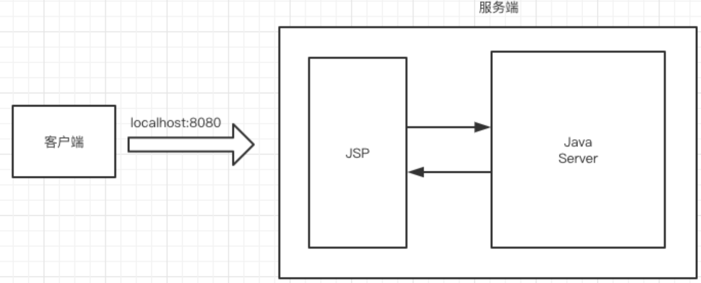
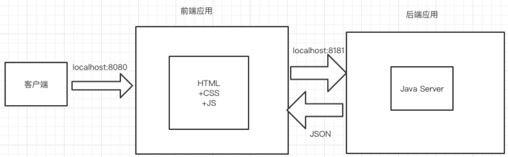

# springboot+vue

## 前后端分离

前后端分离就是将⼀个应⽤的前端代码和后端代码分开写，为什么要这样做？
如果不使⽤前后端分离的⽅式，会有哪些问题？
传统的 Java Web 开发中，前端使⽤ JSP 开发，JSP 不是由后端开发者来独⽴完成的。
前端---》HTML 静态⻚⾯ ---〉后端 ---》JSP
这种开发⽅式效率极低，可以使⽤前后端分离的⽅式进⾏开发，就可以完美地解决这⼀问题。

前端只需要独⽴编写客户端代码，后端也只需要独⽴编写服务端代码提供数据接⼝即可。
前端通过 Ajax 请求来访问后端的数据接⼝，将 Model 展示到 View 中即可。

前后端开发者只需要提前约定好接⼝⽂档（URL、参数、数据类型...），然后分别独⽴开发即可，前端
可以造假数据进⾏测试，完全不需要依赖于后端，最后完成前后端集成即可，**真正实现了前后端应⽤的**
**解耦合**，极⼤地提升了开发效率。

单体：前端应⽤ + 后端应⽤
前端应⽤：负责数据展示和⽤户交互。
后端应⽤：负责提供数据处理接⼝。
**前端 HTML ---〉Ajax ---〉RESTful 后端数据接⼝。**

传统的单体应⽤




前后端分离的结构



==前后端分离就是将⼀个单体应⽤拆分成两个独⽴的应⽤，前端应⽤和后端应⽤以 JSON 格式进⾏数据交
互。==


## 实现技术

Spring Boot + Vue
使⽤ Spring Boot 进⾏后端应⽤开发，使⽤ Vue 进⾏前端应⽤开发。


### Vue + Element UI

Vue 集成 Element UI
Element UI 后台管理系统主要的标签：

* el-container：构建整个⻚⾯框架。
* el-aside：构建左侧菜单。
* el-menu：左侧菜单内容，常⽤属性：
  * :default-openeds：默认展开的菜单，通过菜单的 index 值来关联。
  * :default-active：默认选中的菜单，通过菜单的 index 值来关联。
* el-submenu：可展开的菜单，常⽤属性：
  * index：菜单的下标，⽂本类型，不能是数值类型。
* template：对应 el-submenu 的菜单名。
* i：设置菜单图标，通过 class 属性实则
  * el-icon-messae
  * el-icon-menu
  * el-icon-setting
* el-menu-item：菜单的⼦节点，不可再展开，常⽤属性：
  * index：菜单的下标，⽂本类型，不能是数值类型。


### Vue router 来动态构建左侧菜单

* 导航1
  * 页面1
  * 页面2
* 导航2
  * 页面3
  * 页面4


### menu 与 router 的绑定
1、 标签添加 router 属性。
2、在⻚⾯中添加 标签，它是⼀个容器，动态渲染你选择的 router。
3、 标签的 index 值就是要跳转的 router


### Element UI 表单数据校验

定义 rules 对象，在 rules 对象中设置表单各个选项的校验规则

```vue
rules: {
    name: [
        { required: true, message: 'error', trigger: 'blur' },
        { min: 3, max: 5, message: '⻓度在 3 到 5 个字符', trigger: 'blur' }
    ]
}
```

required: true, 是否为必填项
message: 'error', 提示信息
trigger: 'blur'，触发事件